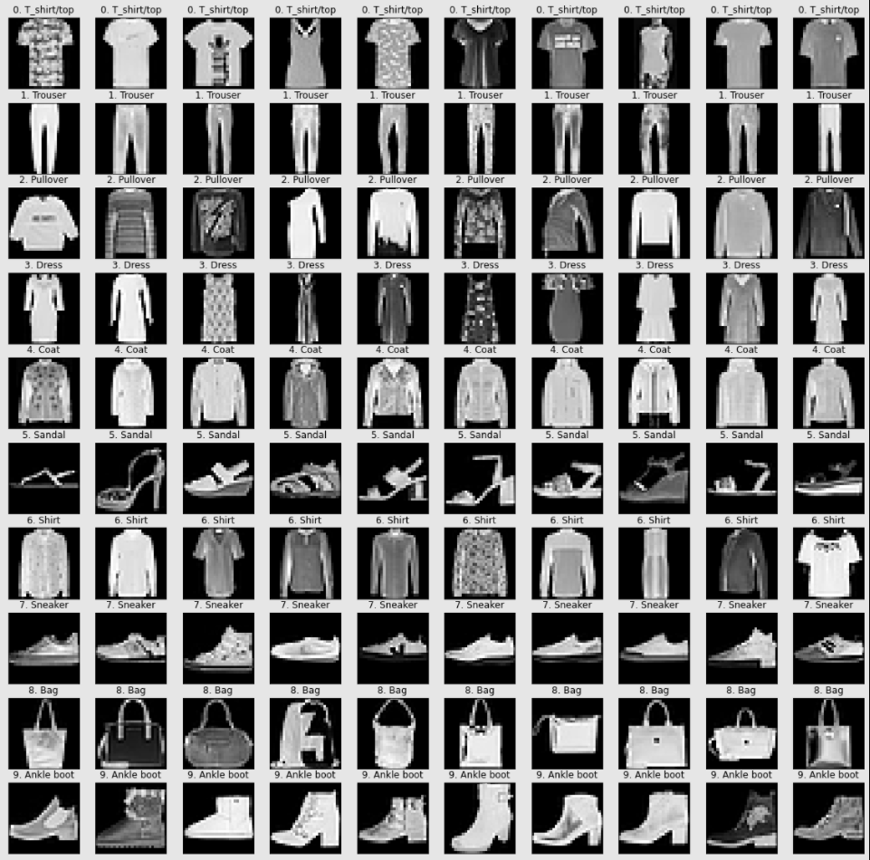

# Fashion-MNIST

Prediction of Clothing Class

## Dataset

[Fashion-MNIST](https://github.com/zalandoresearch/fashion-mnist) is a dataset of Zalando's article images—consisting of a training set of 60,000 examples and a test set of 10,000 examples. Each example is a 28x28 grayscale image, associated with a label from 10 classes.  

## Model

- LeNet (baseline)
- AlexNet
- VGGNet
- ResNet
- EfficientNet
